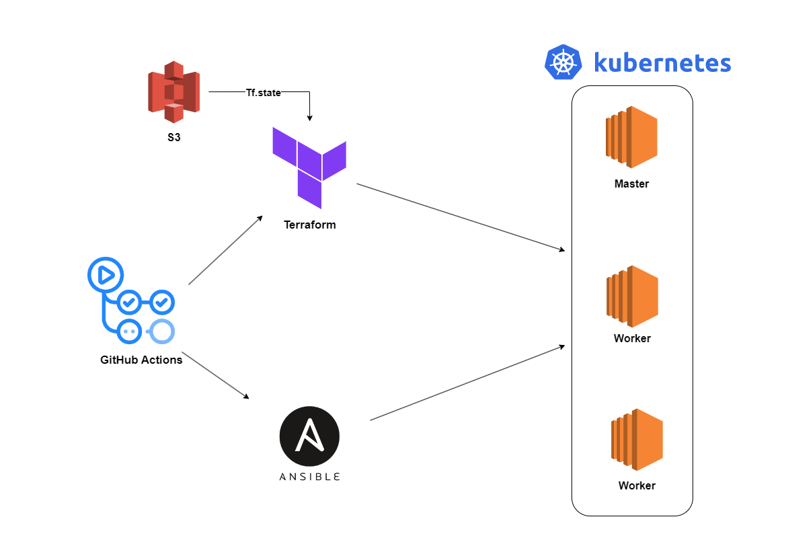

# K8S Single Cluster Spinup

Personal project to setup a Kubernetes cluster within 3 instances on AWS

## How does it work?
- Terraform that creates 3 AWS instances, a Security Group, and a Keypair.
- The tf.state backend file is stored in an AWS S3 bucket.
- Ansible installs and configures Kubernetes with all dependencies with kubeadm.
- The workflow is automated using GitHub Actions.
- GitHub Actions uses a Docker container with Terraform and Ansible.

## Workflow Diagram
